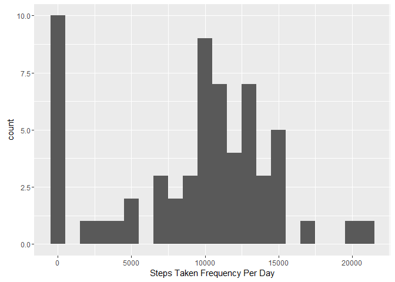
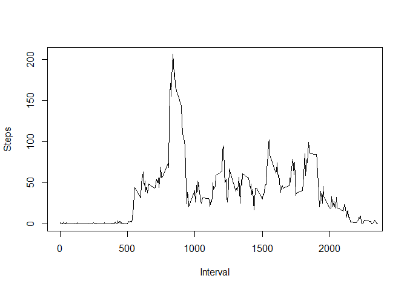
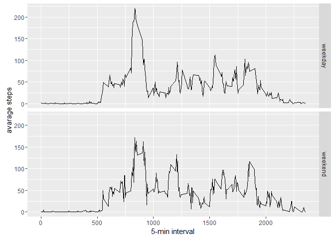

# Reproducible Research: Peer Assessment 1
Ahmed Moatasem  
January 19, 2017  

## Loading and preprocessing the data
* unzipping file and read data
* Date column transformation to POSIXct format for convience.

```r
unzip(zipfile = "activity.zip")
data <- read.csv("activity.csv")
data$date <- as.POSIXct(data$date)
```


## Mean of total number of steps taken per day

##### Total number of steps taken per day

```r
stepsPerDay <- tapply(data$steps, data$date, sum, na.rm = TRUE)
```

##### Histogram of the total number of steps taken each day

```r
library(ggplot2)
```

```
## Warning: package 'ggplot2' was built under R version 3.2.5
```

```r
qplot(stepsPerDay, geom = "histogram", xlab = "Steps Taken Frequency Per Day",  binwidth = 1000)
```

<!-- -->

##### Mean and Median of the total number of steps taken per day

```r
mean(stepsPerDay, na.rm = TRUE)
```

```
## [1] 9354.23
```

```r
median(stepsPerDay, na.rm = TRUE)
```

```
## [1] 10395
```


## Average daily activity pattern

#### plot of averaged steps by interval

```r
stepsInterval <- aggregate(steps ~ interval, data, mean, na.rm = TRUE)
plot(stepsInterval$interval, stepsInterval$steps, type="l", xlab="Interval", ylab="Steps", xlim = c(0,2300))
```

<!-- -->

```r
steps_by_interval <- aggregate(steps ~ interval, data, mean)
```

#### get maximum number of steps on the averaged steps-interval

```r
stepsInterval[which.max(stepsInterval$steps),]
```

```
##     interval    steps
## 104      835 206.1698
```


## Imputing missing values
#### number of rows with missing values in the dataset

```r
sum(!complete.cases(data))
```

```
## [1] 2304
```
#### filling missing values of steps by interval mean, and creating new filled dataset

```r
intervalMeans <- tapply(data$steps, data$interval, mean, na.rm = TRUE)
newData <- data
for(i in 1:nrow(newData))
{
  if(is.na(newData[i,1]))
  {
    inter <- newData[i,3]
    inter <- as.character(inter)
    newData[i,1] <- intervalMeans[[inter]]
  }
}
```

#### Steps taken per day new Histogram after filling NAs


```r
stepsAfterFill <- tapply(newData$steps, newData$date, FUN = sum)
qplot(stepsAfterFill, binwidth = 1000, xlab = "total number of steps taken each day")
```

<!-- -->

#### new mean and median after imputting missing values


```r
mean(stepsAfterFill, na.rm = TRUE)
```

```
## [1] 10766.19
```

```r
median(stepsAfterFill, na.rm = TRUE)
```

```
## [1] 10766.19
```
* Median and Mean are different from there original values before removing NAs.
* Affected the histogram that days with most NAs are set to 0s so they doesn't appear on the chart. 

## Differences in activity patterns between weekdays and weekends


#### Factorize data by weekday and weekend

```r
days <- character()
for(j in 1:nrow(newData))
{
  d <- weekdays(as.Date(newData[j,2]))
  if(d %in% c("Saturday", "Sunday"))
  {
    days <- c(days, "weekend")
  }else{
    days <- c(days, "weekday")
  }
}
newData$day <- as.factor(days)
```

#### Compare average steps on intervals between weekdays and weekends

```r
avgStpsIntsByDay <- aggregate(steps ~ interval + day, data=newData, mean)
ggplot(avgStpsIntsByDay, aes(interval, steps)) + 
    geom_line() + 
    facet_grid(day ~ .) +
    ylab("avarage steps") +
    xlab("5-min interval") 
```

<!-- -->
